# Lunar Blue for Omarchy

A graphite-dark Omarchy theme with luminous lunar-blue accents, inspired by
the calm, technical color language of [zed.dev](https://zed.dev/).

The theme is original and is not affiliated with or endorsed by Zed Industries.

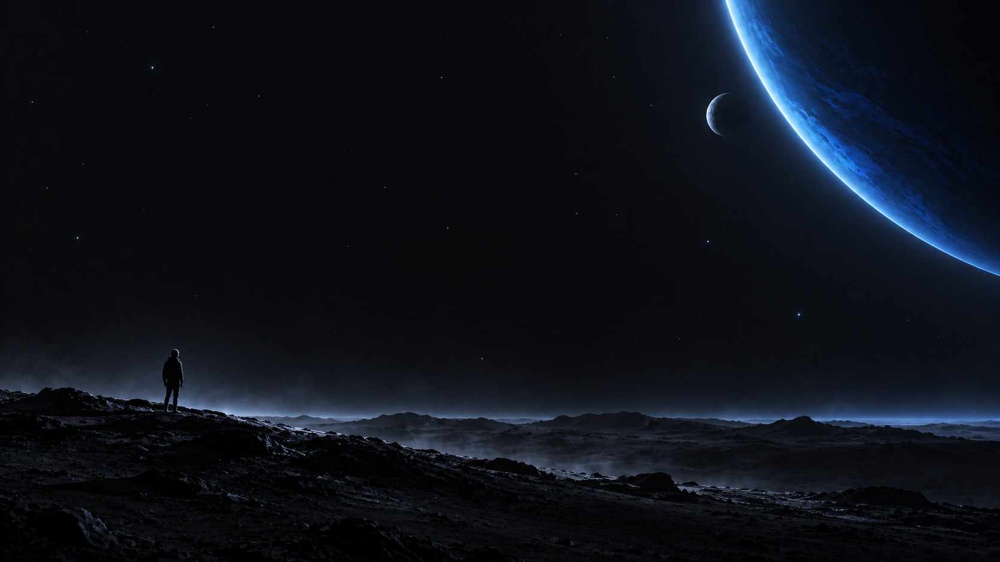

The theme includes thirteen original wallpapers ranging from cinematic space
compositions to manga-inspired solitude and dark surreal scenes.

## Wallpapers

| Wanderer | Eclipse |
| --- | --- |
|  | 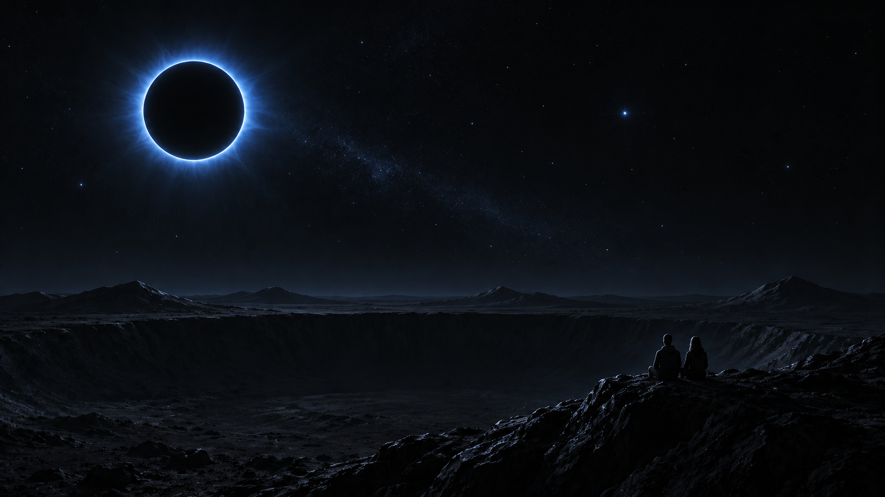 |
| **Solar system** | **Ringed world** |
| 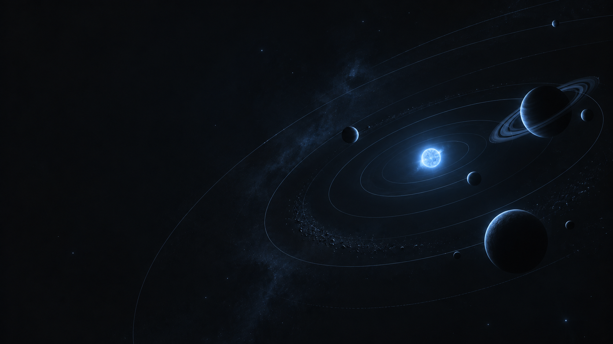 | 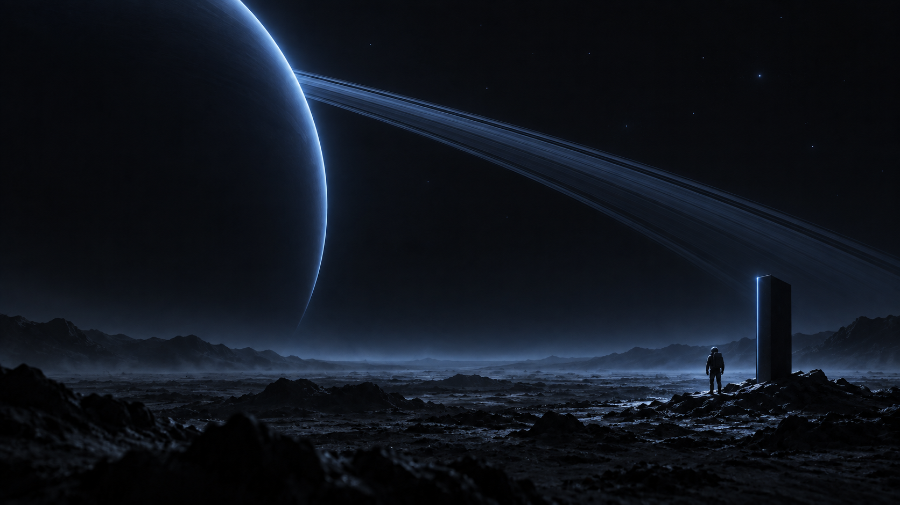 |
| **Observatory** |  |
| 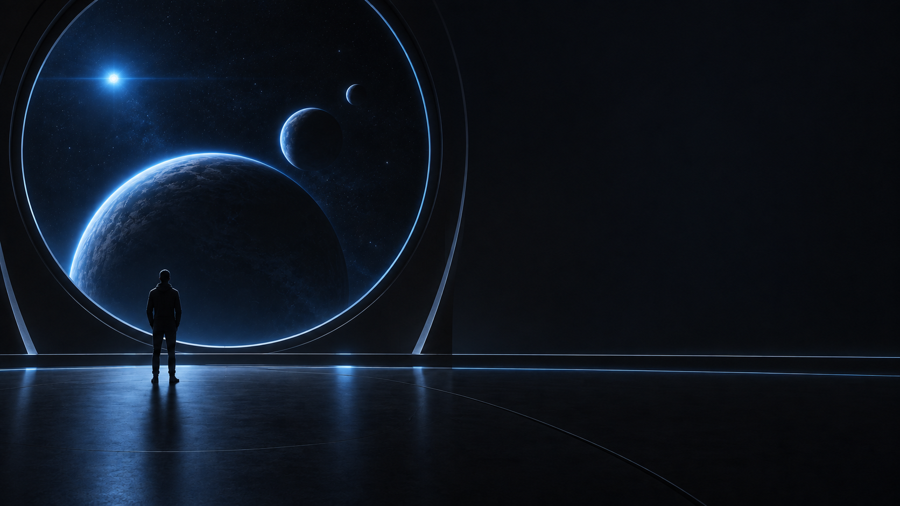 |  |

### Solitude series

| On the ridge | Wreckage |
| --- | --- |
| 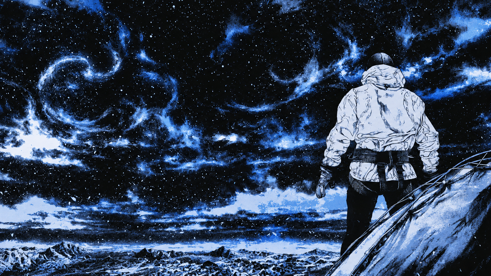 | 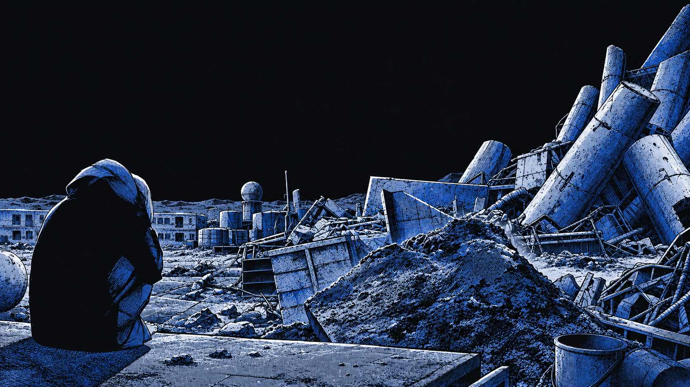 |
| **Climb** | **Ether** |
|  | 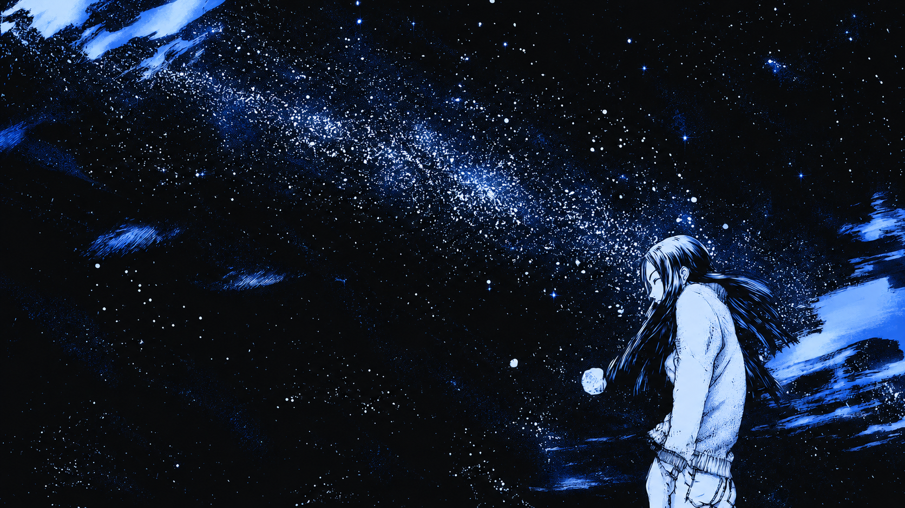 |
| **Eyed** |  |
| 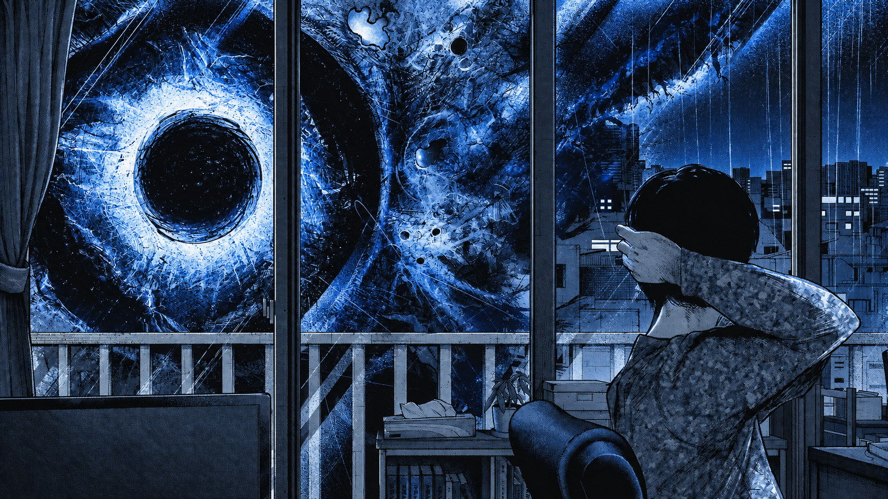 |  |

### Miasma series

| Nature of fear | Crowned |
| --- | --- |
| 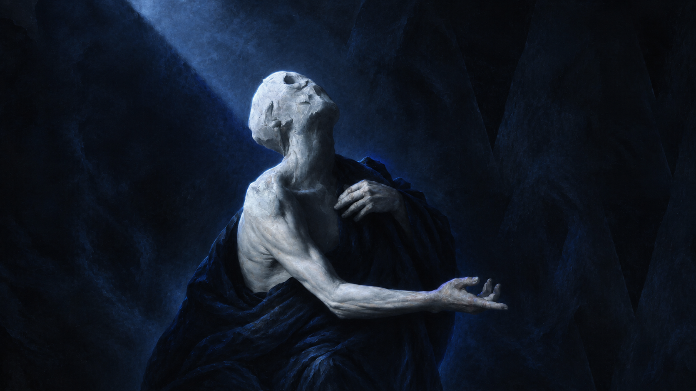 | 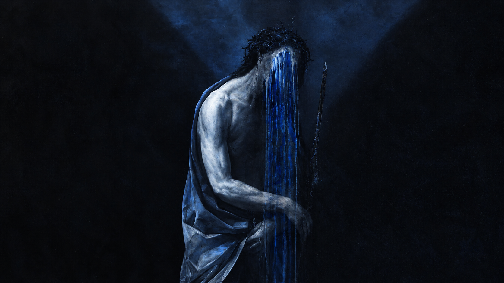 |
| **Omarchy** |  |
| 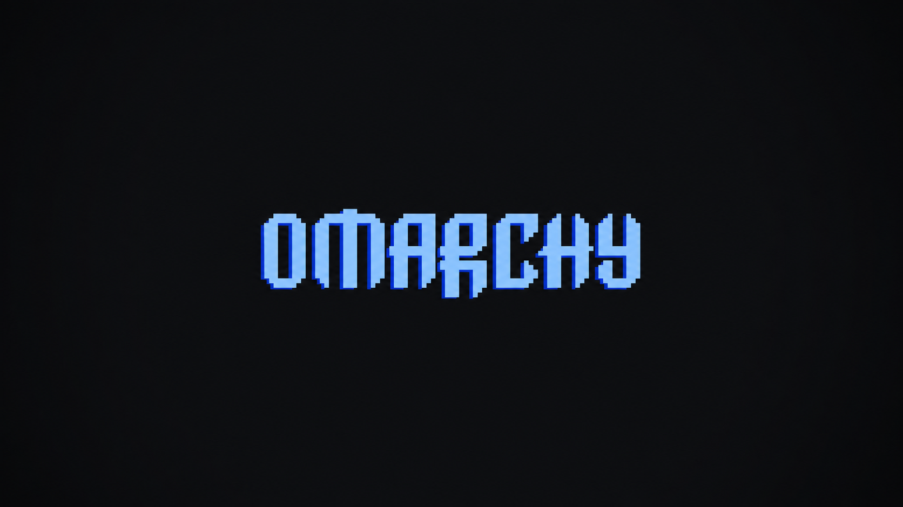 |  |

## Palette

| Role | Color |
| --- | --- |
| Background | `#121316` |
| Dark background | `#0d0d0f` |
| Raised surface | `#212328` |
| Foreground | `#e8edf5` |
| Muted text | `#818b9d` |
| Accent | `#8ec5ff` |
| Blue | `#8ec5ff` |
| Deep selection | `#1348dc` |

## Install

```bash
omarchy theme install https://github.com/joaocardosodias/omarchy-lunar-blue-theme.git
```

Because the repository is named `omarchy-lunar-blue-theme`, Omarchy installs
it under the name `lunar-blue` and applies it automatically.

To apply it again later:

```bash
omarchy theme set lunar-blue
```

## Local development

To test a working tree without cloning it again:

```bash
ln -s "$(pwd)" ~/.config/omarchy/themes/lunar-blue
omarchy theme set lunar-blue
```

Remove the symlink when finished:

```bash
unlink ~/.config/omarchy/themes/lunar-blue
```

## Included

- A complete `colors.toml` palette used by Omarchy to generate terminal,
  shell, Hyprland, editor, and application colors.
- A custom `shell.toml` with solid graphite surfaces, vivid blue focus
  states, and fine borders.
- A blue Yaru icon theme preference.
- Thirteen original dark wallpapers with planets, orbits, human silhouettes,
  and Lunar Blue reinterpretations of the Solitude and Miasma visual languages.

## Recommended typography

Lunar Blue pairs well with the same typographic roles used by Zed's visual
language:

- **Lilex Nerd Font Mono** for terminals and code.
- **IBM Plex Sans** for application interfaces.
- **iA Writer Quattro S** for Omarchy menus and editorial text.

On Arch Linux, the packaged dependencies are:

```bash
omarchy pkg add ttf-ibm-plex ttf-lilex-nerd
```

## Requirements

Built and tested against Omarchy 4.0.x's `colors.toml` theme format.
